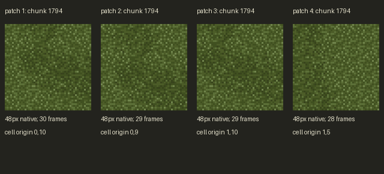

# Temporary art previews

Share this page with Grok to review the latest completed images. Temporary previews and references are not production approvals.

**Latest: [Ultima VII ground reference comparison — 6 October 2026](references/2026-10-06-u7-ground-r01/README.md).**

- [Direct PNG](https://raw.githubusercontent.com/willshw89/Deus/main/art/junk/references/2026-10-06-u7-ground-r01/u7_ground_reference_comparison.png)
- [Image details and hash](references/2026-10-06-u7-ground-r01/manifest.json)

New completed previews go in dated folders under `art/junk/<subject>/`. Keep earlier previews available. Copy published pixels without recoloring or resampling. Provider payloads, credentials, engine files and production packs remain outside this folder. U7 examples are reference-only, not Endrath game art.

## Archive

- [2026-10-06 — Ultima VII ground reference comparison](references/2026-10-06-u7-ground-r01/README.md)
- [2026-10-06 — Soil Map003 revision 6](soil/2026-10-06-map003-r06/README.md)
