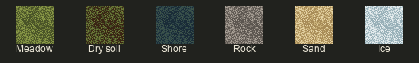
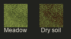

# Ground fills — meadow and dry soil

Owner-selected working fills, 6 October 2026. All files are native 48×48 PNGs, with exact palette remaps and unchanged pixel coordinates.

The Owner selected the five U7 recolors for use. Dry soil is the meadow with its palette stepped down: `#8A9A48 → #6E7A38`, `#6E7A38 → #4A5428`, `#4A5428 → #3A2414`.

- [Meadow](soil_fill.png)
- [Dry soil](soil_dry_fill.png)
- [Shore](shore_fill.png)
- [Rock](rock_fill.png)
- [Sand](sand_fill.png)
- [Ice](ice_fill.png)
- [Source lineage, palettes and hashes](manifest.json)

Provenance: these are direct recolors of Ultima VII: The Black Gate native ground pixels, not new original drawings. The canonical art files and catalog are local; these are exact review copies. The previous PixelLab keeps are archived separately. Pack is empty; this step does not assemble A2 blocks or a playable map. No new generation was used for the recolors.
