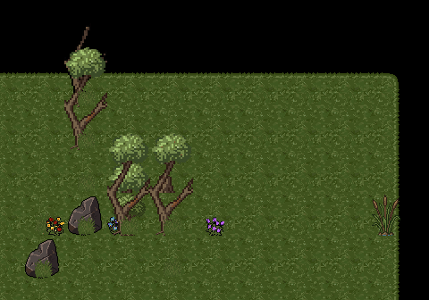
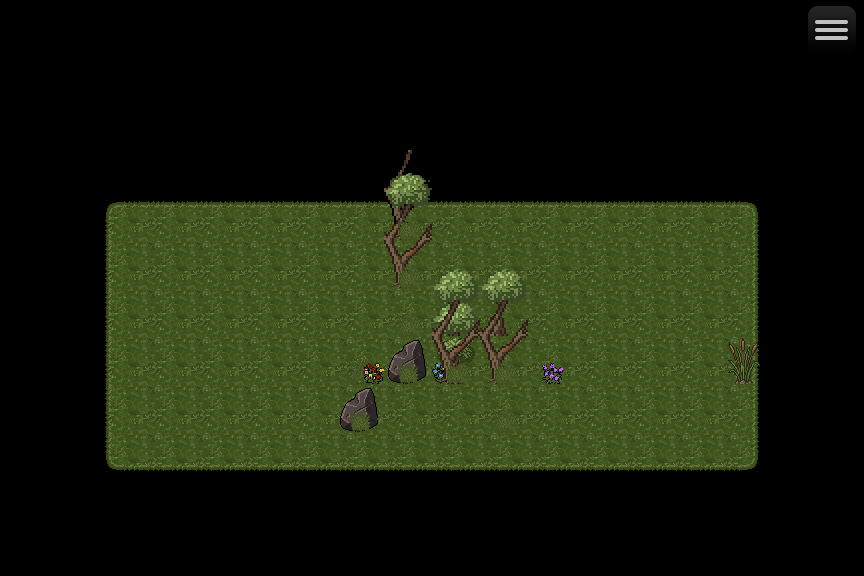

# Soil — Map003, revision 6

Temporary review from 6 October 2026. These are captures of **Soil - rooted cluster**, an actual RPG Maker MZ map using native tile and event display. This revision adds the rooted tree contacts, broken stone bottom contact, adjacent flowers, and the shore reed. The PNGs preserve their original pixels; the close view is an unscaled crop.

Owner visual acceptance of revision 6 remains pending. These images are review material and are not a production asset pack or a browser-playable map.

## Cluster at 100%

[Open the PNG directly](https://raw.githubusercontent.com/willshw89/Deus/main/art/junk/soil/2026-10-06-map003-r06/map003_100_percent.png) — 480 × 336.

## Full map

[Open the PNG directly](https://raw.githubusercontent.com/willshw89/Deus/main/art/junk/soil/2026-10-06-map003-r06/map003_full.png) — 864 × 576.

File hashes and capture details are in [manifest.json](manifest.json). [Return to the temporary art index](../../README.md).
