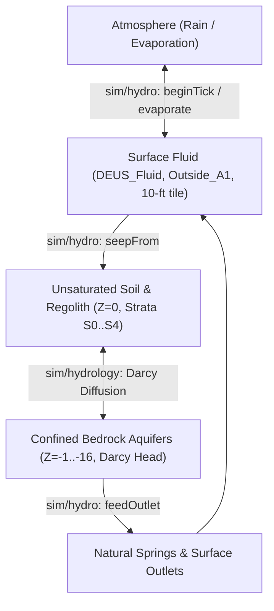

# Map of Unloaded Simulation Kernels & Minimal Engine Bridges

**Document Authority**: Project DEUS Systems Architecture (DEC-037 Natural World Phase Lock, DEC-038 Math Foundations, DEC-040 Universal Closed-Mass Invariant)  
**Date**: 2026-09-29  

---

## 1. Executive Summary

Project DEUS possesses three standalone, deterministic physics kernels under `game/js/sim/` that are fully tested offline in Node but not yet connected to the RPG Maker MZ runtime loop or plugin pipeline:
1. **Matter Kernel**: `game/js/sim/structural/` (support evaluation, cantilever limits, and cascading collapse).
2. **Subterranean Groundwater Kernel**: `game/js/sim/hydrology/` (2-ft strata-level Darcy flow, hydraulic head, and aquifer saturation).
3. **Surface & Atmospheric Water Kernel**: `game/js/sim/hydro/` (10-ft tile fluid dynamics, lake evaporation, precipitation, and percolation).

This map defines the precise physical boundaries of each kernel, contrasts `sim/hydrology` with `sim/hydro`, and outlines the **smallest possible bridge** required to wire each into the live game without scope bloat.

---

## 2. Matter Kernel: `game/js/sim/structural/`

### 2.1 Physics & Scope
- **Authority**: NAT.02.01 (`support.js`, `collapse.js`, `index.js`).
- **Resolution**: 5-ft $\times$ 5-ft $\times$ 2-ft stratum cell volume ($50.0\text{ cu ft}$).
- **Mechanics**:
  - **Compressive Vertical Support**: Load transmits directly down to bedrock/solid ground foundation (`mode: "vertical"`).
  - **Tensile Cantilever Spans**: Overhangs and ceilings extend horizontally up to $\lfloor\text{tensileYield} / (\text{density} \times 10)\rfloor$ tiles from a supported anchor (`mode: "cantilever"`).
  - **Cascading Collapse**: Iterative failure loop (up to 32 cascade steps) when an anchor or foundation cell is destroyed.
  - **Closed-Mass Transfer**: Converts collapsed solid rock into loose rubble items ($\text{mass} = 50.0 \times \text{density}$) deposited on the receiving floor; debits solid mass and credits loose items via `ledger.js`.

### 2.2 Why the Game Does Not Load It Yet
Currently, `DEUS_Levels.js` manages voxel destruction via `applyVolumeDamage()` and `setStrata()`. When a player digs or an explosion breaches rock, only the targeted stratum is cleared. Overhead strata hang unsupported in the air as floating voxels because `DEUS_Levels.js` has no structural verification hook.

### 2.3 Smallest Possible Bridge (`DEUS_StructuralBridge.js` / Plugin Hook)
- **Runtime Hook**: Hook `DEUS_Levels.applyVolumeDamage` and `levels:strataDestroyed`.
- **Trigger**: When any stratum with $s \le 4$ transitions from solid to air/open.
- **Minimal Bridge Logic**:
  1. Identify candidate cells in the vertical column and lateral radius (1-tile cantilever box) directly above the excavated cell.
  2. For each candidate cell, invoke `evalCellSupport(cellData, material, neighborBelow, neighborHoriz)`.
  3. If unsupported, pass candidate array to `executeCollapse(cells, worldState, ledger)`.
  4. For each cell returned by `executeCollapse`:
     - Call `DEUS_Levels.setStrata(ref, { m: [M_AIR, M_AIR, M_AIR, M_AIR, M_AIR] })`.
     - Call `DEUS_Items.spawnItem("item_stone_rubble", { x, y, z: landingZ, mass: displacedMass })`.
- **Lines of Code**: ~60 lines.

---

## 3. Water Subsystems: `sim/hydrology` vs. `sim/hydro`

### 3.1 Architectural Contrast Matrix

| Attribute | `game/js/sim/hydrology/` (NAT.03.01) | `game/js/sim/hydro/` (WG.00.08) |
|---|---|---|
| **Domain** | Subterranean Deep Groundwater & Strata Saturation | Surface Fluid Bodies, Atmosphere & Soil Percolation |
| **Grid Resolution** | **2-ft Strata**: Discrete stratum $(x, y, z, s)$ with $s \in [0..4]$ | **10-ft Tile**: Full Z cell $(ax, ay, x, y, z)$ with fluid depth $0..7$ |
| **Physical Law** | Darcy's Law: $q = -K \nabla h$ across 6-neighbor lattice | Cellular Automata: Depth equilibration ($0..7$ units), lateral spread |
| **Driving Potential** | Integer hydraulic head datum: $h = z_{\text{elev}} + \psi_{\text{pressure}}$ (millistrata) | Gravity step + lateral height gradient |
| **Conductivity Model** | Harmonic mean: $K_{\text{int}} = \lfloor(2 K_A K_B) / (K_A + K_B)\rfloor$ | Discrete permeability tiers ($0..6$) with harmonic bottlenecking |
| **Flux Precision** | Signed canonical edge residuals: $\min(A,B):\max(A,B)$ | Integer fluid units ($1\text{ unit} \approx 7.14\text{ cu ft}$) |
| **Mass Conservation** | Integer centipounds ($\text{density} = 6,240\text{ cp/cu ft}$) | Fluid unit accounting ($\text{atmosphere} + \text{displaced} + \text{aquifers} + \text{grid}$) |
| **Direct Consumer** | Subterranean mines, cave seepage, well water table, spring pressure | Standing water puddles, lake levels, rainfall, surface mud |

---

### 3.2 Subterranean Aquifers: `game/js/sim/hydrology/`

#### Mechanics
- Maintains pore water mass within porous geological strata (sandstone, gravel, soil).
- Each stratum holds up to $312,000\text{ centipounds}$ of water ($\text{porosity} \le 100\%$).
- Simulates water table elevation, artesian pressure in confined aquifers, and slow groundwater migration toward valleys.

#### Smallest Possible Bridge
- **Hook Point**: World load (`UF.World.state.levels`) + Seasonal/Daily simulation tick.
- **Minimal Bridge Logic**:
  1. On area load, instantiate `AquiferEngine` for active area strata columns. Initialize `Stratum` instances from `DEUS_Levels` geological materials.
  2. On environmental pulse (e.g. daily tick): execute `engine.stepDiffusion()`.
  3. **Interface to Surface**: If water table head $h$ in an unconfined surface stratum exceeds stratum capacity ($\text{saturation} \ge 100\%$), bleed overflow into `DEUS_Fluid` on level $z$ by converting centipounds into fluid depth units:
     $$\Delta\text{depth} = \left\lfloor \frac{\text{overflowCentipounds}}{44,571} \right\rfloor$$
- **Lines of Code**: ~85 lines.

---

### 3.3 Surface Water & Weather Ledger: `game/js/sim/hydro/`

#### Mechanics
- Connects surface water bodies (`Outside_A1` / `DEUS_Fluid`) to atmosphere and column storage.
- Lake evaporation debits surface depth and credits atmospheric water vapor.
- Precipitation debits atmospheric vapor and deposits rain onto exposed surface cells.
- Surface water resting on permeable ground slowly seeps down through soil into column aquifers (`seepFrom`).
- Springs debit column aquifers and push water up through surface outlets (`feedOutlet`).

#### Smallest Possible Bridge
- **Hook Point**: `DEUS_Fluid.js` step loop + `DEUS_Environment.js` day/night cycle.
- **Minimal Bridge Logic**:
  1. In `DEUS_Fluid.step()`, provide the `io` callback interface wrapping `UF.Fluid` read/write.
  2. Call `session.feedOutlet(ax, ay, x, y, z)` for registered natural spring coordinates.
  3. When fluid settles in a cell ($d > 0$), invoke `session.seepFrom(ax, ay, x, y, z)` to drain surface puddles into porous ground at rate governed by `materials.json` permeability.
  4. On weather state change (rain event), invoke `session.beginTick({ budget: 512 })` to place atmospheric rain into lakes/soil.
- **Lines of Code**: ~70 lines.

---

## 4. Architectural Synthesis: The Unified Water Pipeline

Rather than competing, the two water modules form an authentic two-tier hydrologic cycle:

1. **Macro Level (`sim/hydro`)**: Handles fast-moving surface water, rain input, lake evaporation, and simple vertical drainage.
2. **Micro Level (`sim/hydrology`)**: Handles slow, subterranean Darcy seepage, hydrostatic pressure, and true groundwater tables.
3. **Mass Invariant**: Both modules conserve water mass without magical spontaneous generation.

---

## 5. Implementation Roadmap Order (Strict Lean DEC-037 Sequence)

Per Owner DEC-037 Natural World Phase Lock, upstream physical authorities must be gated before downstream consumers:

1. **Gate Verification & Tile Wiring**: Complete core gate suites (`lane-bb`) and wire placeholder tiles (`lane-wire`).
2. **Matter Stability Bridge**: Wire `game/js/sim/structural/` into `DEUS_Levels.applyVolumeDamage` so digging honors gravity.
3. **Surface Water Drainage Bridge**: Wire `game/js/sim/hydro/` into `DEUS_Fluid` for percolation and spring delivery.
4. **Deep Aquifer Bridge**: Connect `game/js/sim/hydrology/` to provide true subterranean water table physics for wells and caverns.
